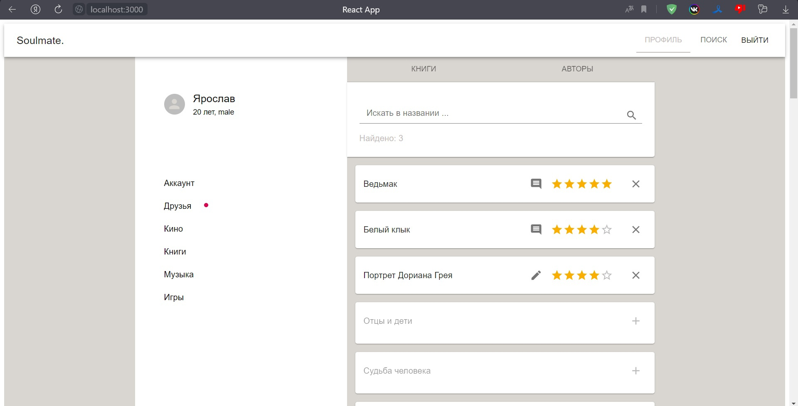
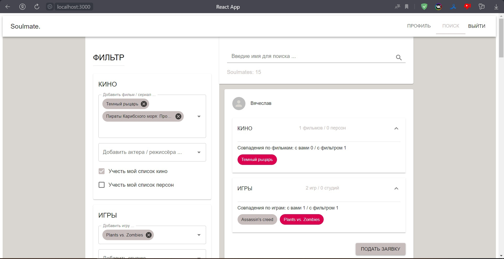
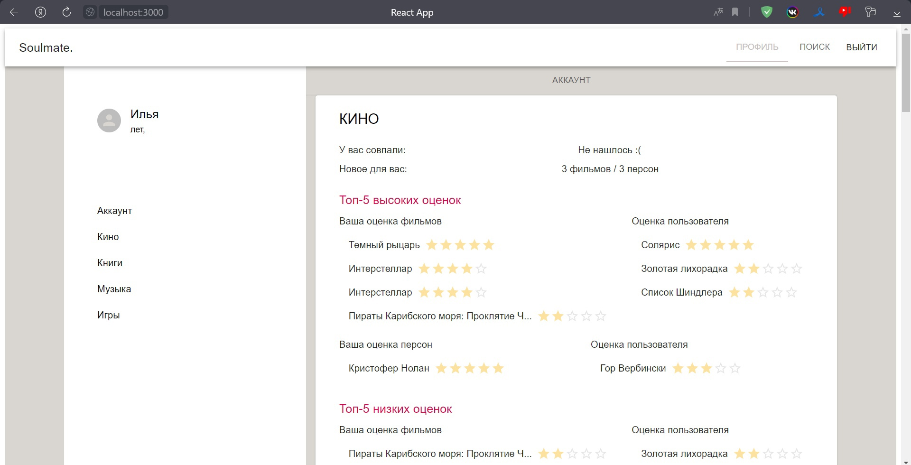
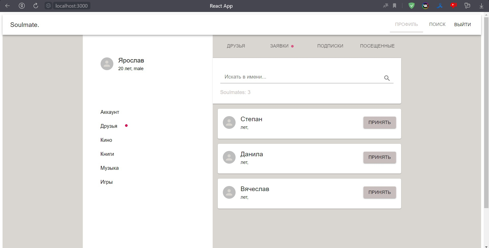

# ОПИСАНИЕ
Сайт для поиска людей по интересам.  
Пользователи заводят личную страницу, на которой в каждой категории (ФИЛЬМЫ, КНИГИ, МУЗЫКА, ИГРЫ) указывают конкретные произведения и рейтинг, насколько это произведение им нравится.

Пользователи могут искать других пользователей по фильтрам:  
- Есть пересечение множеств любимых произведений  
- Во множество произведений входит подмножество, заданное в фильтрах вручную.
  
Пользователей, подходящих под фильтр, можно отсортировать.  
- Сортировка по умолчанию: от наибольшего суммарного числа совпадений к меньшему.  
- Сортировка по 1 приоритету: от пользователей с наибольшим числом совпадений по выбранной категории к меньшему.  
- Сортировка по >1 приоритету: пользователи с равным числом совпадении приоритета K сортируются от большего к меньшему числу совпадений в приоритете K+1  
Отличительная черта: возможность поиска людей по конкретному списку произведений, а не по крупным жанрам. Это скорее база данных с предпочтениями, чем социальная сеть.  

  
Пользователи могут увидеть о другом пользователе:  
- Личные данные: никнейм, аватар, возраст, пол, ссылка на telegram*  
(* если этот пользователь является другом).  
- Списки любимых произведений в категории. Рэйтинг, поставленный этому произведению пользователем. Комментарий пользователя насчет этого произведения.  
- Информация о совпадении интересов пользователей.  

  
Чтобы начать общение, пользователи могут отправлять пользователям запрос в друзья. Если запрос будет одобрен, пользователям станет доступна ссылка на telegram друга-друга.  
  
Также ведется учет заявок в друзья (в разделе «Заявки») и собственных заявок другим людям (в разделе «Подписки»). Однажды просмотренные профили пользователей сохраняются в истории, чтобы их можно было повторно найти.  

  
# НАИМЕНОВАНИЕ
Soulmate.

# Предметная область
социальные сети

# ДАННЫЕ
(в диаграмме ER_diagram, TZ_xml.txt)

# UI
(скриншоты в папке screens)
# ПОЛЬЗОВАТЕЛЬСКИЕ РОЛИ
## Пользователи
- доступ к поиску пользователей по фильтру избранного.
- доступ к просмотру личной информации и избранного других пользователей, оставленных ими комментариев и их оценкам к их избранному
- доступ к редактированию своей личной информации
- доступ к добавлению/удалению своих избранных элементов, комментированию и выставлению рэйтинга им.
- доступ к созданию связей с людьми: просмотр посещенных ранее аккаунтов, отправка заявки в друзья, отслеживание и отзывание своих подписок (отправленных, но не принятых заявок), удаление из друзей.
## Модератор: 1 человек
- доступ к содержимому комментариев, отправленных на модерацию
- одобрение или отклонение комментария
# API
(см. файл API_documentation)
# Технологии разработки
## Front-end
- язык Typescript
- библиотеки React, Redux, RTX Query, oauth Yandex, Material UI
## Back-end
- язык Python
- библиотеки Flask, SQL Alchemy
# СУБД
MySQL
# Тестирование
ручное  
(тестовые данные, скрипт для запуска: TestData.sql)
